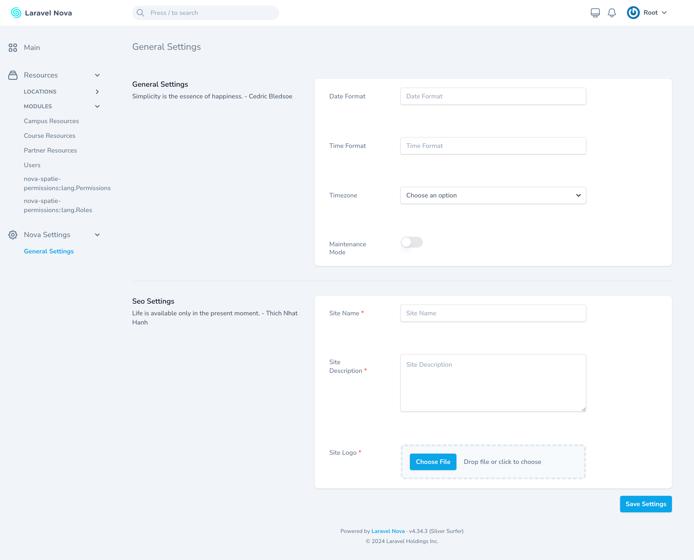
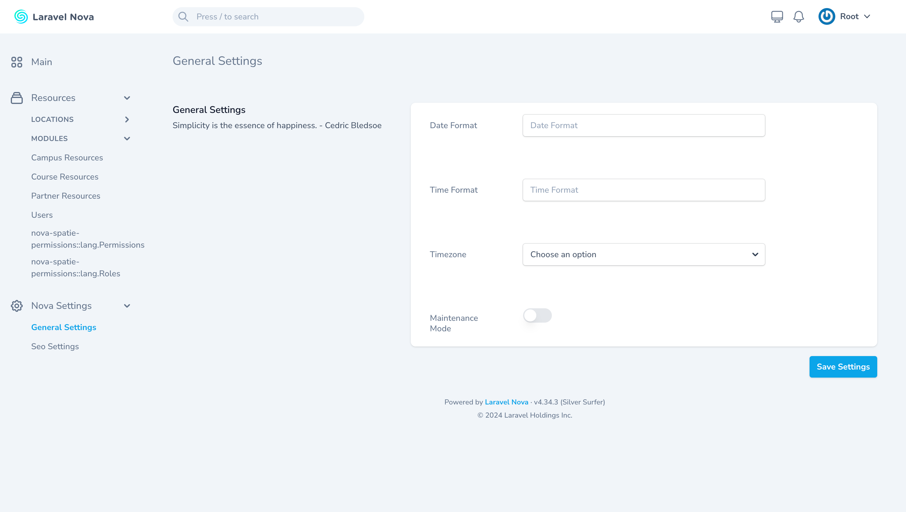
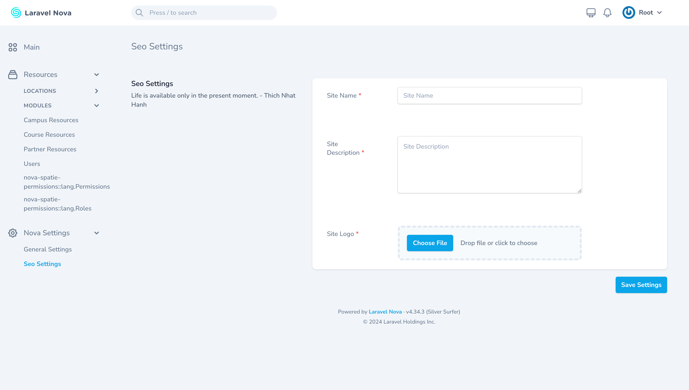

# Nova Settings

**WIP: This project is a Work in Progress. Features and documentation might change.**

Nova Settings is a Laravel Nova package that provides an intuitive interface for managing settings using Spatie's settings package.

### Screenshots






### Installation

To install Nova Settings, you can use Composer:

```bash
composer require ferdiunal/nova-settings
```

After installing the package, you need to register the tool with Nova. Add the following to your **NovaServiceProvider**:

```php
// in app/Providers/NovaServiceProvider.php

use Ferdiunal\NovaSettings\NovaSettings;

public function tools()
{
    return [
        new NovaSettings,
    ];
}
```

### Create Settings Resource

```bash
php artisan make:settings-resource GeneralSettings --group General   
# Resource created successfully.
# Resource path: app/NovaSettings/GeneralSettings.php
```

### Usage

After installation, you can access the settings interface from the Nova dashboard. This interface allows you to easily manage your application's settings without writing any additional code.

To use the `SettingsHelper` class, you can utilize the provided `settings` helper function. Here are some examples:

```php
use function Ferdiunal\NovaSettings\settings;

// Accessing all settings
$allSettings = settings()->toArray();

// Accessing settings as a collection
$settingsCollection = settings()->toCollection(); // OR
$settingsCollection = settings("general")->toCollection();

// Converting settings to JSON
$jsonSettings = settings()->toJson(); // OR
$jsonSettings = settings("general")->toJson();

// Accessing a specific group of settings
$generalSettings = settings('general')->toArray();

// Accessing a specific setting within a group
$specificSetting = settings('general')->site_name;
$specificSetting = settings('general')->site_name();

// Accessing a nested setting directly
$nestedSetting = settings('general.site_name');
```

### Configuration
Make sure you have Spatie's settings package installed and configured in your Laravel application. You can follow the [official documentation](https://github.com/spatie/laravel-settings?tab=readme-ov-file#installation) for detailed instructions.

### Features
- Easy integration with Laravel Nova
- User-friendly settings management interface
- Compatible with Spatie's settings package


### Contributing
Contributions are welcome! Please feel free to submit a Pull Request or open an issue.

License
This package is open-sourced software licensed under the [MIT license](LICENSE).
